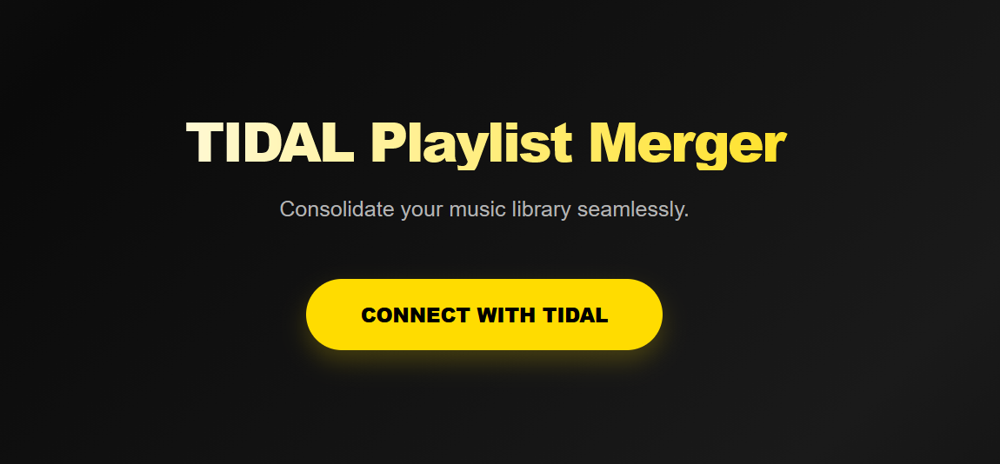

# TIDAL Playlist Merger

Merge multiple TIDAL playlists into one. No API keys or developer registration required.




## Features

- Merge up to 200 playlists at once
- Automatic duplicate track removal
- Real-time progress tracking
- No TIDAL Developer account needed
- Session persistence across restarts

## Demo


## Quick Start

**Prerequisites:** Python 3.9+, Node.js 18+, TIDAL account

```bash
git clone https://github.com/Zephurlbr/TIDAL-Playlist-Merger.git
cd TIDAL-Playlist-Merger

# Windows
start.bat

# macOS/Linux
chmod +x start.sh && ./start.sh
```

Open http://localhost:8000 and connect your TIDAL account.

## Usage

### Authentication

1. Click **"Connect with TIDAL"**
2. Open the provided link (e.g., `https://link.tidal.com/ABC123`)
3. Log in and authorize
4. Return to the app - authentication completes automatically

### Merging Playlists

1. Paste a playlist URL and press Enter
2. Repeat for additional playlists (max 200)
3. Enter a name for your merged playlist
4. Click **"Merge Playlists"**
5. Watch progress in real-time

**Supported URL formats:**
```
https://listen.tidal.com/playlist/<uuid>
https://tidal.com/browse/playlist/<uuid>
https://open.tidal.com/playlist/<uuid>
<raw-uuid>
```

## Tech Stack

- **Backend:** Python, FastAPI, uvicorn, [tidalapi](https://github.com/EbbLabs/python-tidal)
- **Frontend:** React, TypeScript, Vite
- **Auth:** TIDAL device linking flow

## Project Structure

```
TIDAL-Playlist-Merger/
├── client/              # React frontend
│   └── src/
│       ├── App.tsx
│       └── components/
├── server-python/       # FastAPI backend
│   ├── main.py
│   ├── routes/
│   ├── services/
│   └── utils/
├── start.bat           # Windows launcher
└── start.sh            # Unix launcher
```

## API Reference

Base URL: `http://localhost:8000`

| Endpoint | Method | Description |
|----------|--------|-------------|
| `/auth/login` | GET | Get device login URL |
| `/auth/status` | GET | Check auth status |
| `/auth/logout` | POST | Logout and delete session |
| `/api/playlist/resolve` | POST | Resolve playlist from URL |
| `/api/merge` | POST | Merge playlists (SSE stream) |
| `/docs` | GET | Swagger UI |

Full API documentation available at `/docs` when running.

## Configuration

**Backend** (`server-python/.env`):
```env
PORT=8000
TIDAL_COUNTRY_CODE=US
```

**Frontend** (`client/.env`, dev only):
```env
VITE_API_BASE=http://localhost:8000
```

## Troubleshooting

| Issue | Solution |
|-------|----------|
| Port 8000 in use | Kill process or change `PORT` in `.env` |
| CORS error | Access at `http://localhost:8000` (not 5173) |
| Playlist not found | Ensure playlist is **public** |
| Login doesn't complete | Refresh page after authorizing |

## Notes

- Playlists must be **public**
- Max **200 playlists** per merge
- Max **10,000 tracks per playlist** (TIDAL limit)
- **Duplicates** are automatically removed
- Session tokens are stored locally in `server-python/tidal_session.json`

## License

[GNU General Public License v3.0](LICENSE)
