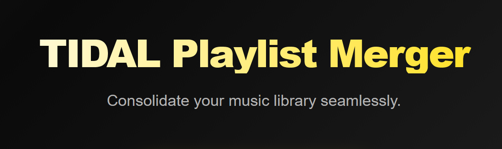
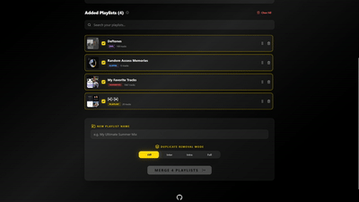
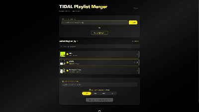
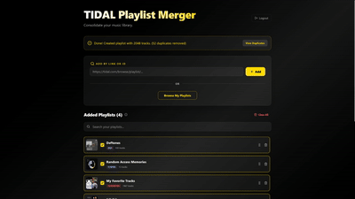
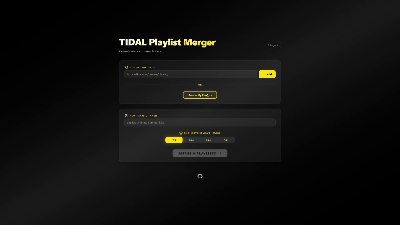
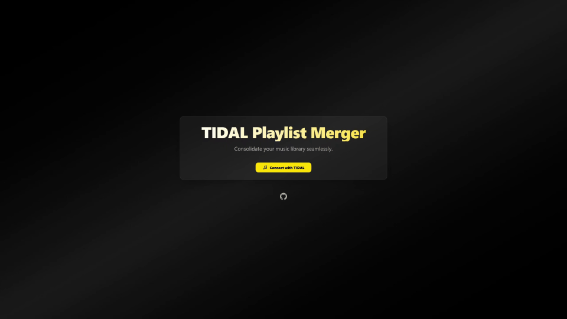

# TIDAL Playlist Merger

Merge multiple TIDAL playlists into one with duplicate track removal. No API keys or developer registration required.




## Features

<table width="100%">
  <tr>
    <td width="50%" align="center">
      <b>In-depth Deduplication</b><br/>
      <br/>
      Choose between Inter, Intra, or Full deduplication to clean your library.
    </td>
    <td width="50%" align="center">
      <b>Album, Mix & Favourites Support</b><br/>
      <br/>
      Paste URLs for Albums, Mixes or your Favourites to easily merge their tracks.
    </td>
  </tr>
  <tr>
    <td width="50%" align="center">
      <b>Duplicate Inspection</b><br/>
      <br/>
      Review exactly which tracks were removed after a merge operation.
    </td>
    <td width="50%" align="center">
      <b>Browse User Library</b><br/>
      <br/>
      Select playlists directly from your library without copy-pasting URLs.
    </td>
  </tr>
</table>

### Core Highlights
- **Drag-and-Drop Reordering**: Determine track order by dragging playlists in the queue.
- **Real-time Progress**: Detailed SSE-streamed progress with duplicate counts.
- **Glassmorphism UI**: Beautiful, responsive design powered by Tailwind CSS v4.
- **Session Persistence**: Automatic re-authentication across restarts.
- **Privacy First**:All session tokens are stored strictly on your local machine in `server-python/tidal_session.json`.

## Demo



## Quick Start

**Prerequisites:** [Python 3.9+](https://www.python.org/downloads/), [Node.js 18+](https://nodejs.org/en/download), TIDAL account

```bash
git clone https://github.com/Zephurlbr/TIDAL-Playlist-Merger.git
```

```bash
cd TIDAL-Playlist-Merger
```

# Windows
```bash
start.bat
```

# macOS/Linux
```bash
chmod +x start.sh && ./start.sh
```

Open http://localhost:8000 and connect your TIDAL account.

## Usage

### Authentication

1. Click **"Connect with TIDAL"**
2. Open the provided link (e.g., `https://link.tidal.com/ABC123`)
3. Log in and authorize
4. Return to the app - authentication completes automatically

### Merging Playlists

1. Paste a playlist URL and press Enter
2. Repeat for additional playlists (max 200)
3. Enter a name for your merged playlist
4. Click **"Merge Playlists"**
5. Watch progress in real-time

**Supported URL formats:**
```
https://listen.tidal.com/playlist/<uuid>
https://tidal.com/browse/playlist/<uuid>
https://open.tidal.com/playlist/<uuid>
<raw-uuid>
```

## Tech Stack

This project wouldn't be possible without [tidalapi](https://github.com/EbbLabs/python-tidal).

- **Backend:** [Python](https://www.python.org/), [FastAPI](https://github.com/tiangolo/fastapi), [uvicorn](https://github.com/encode/uvicorn), [tidalapi](https://github.com/EbbLabs/python-tidal)
- **Frontend:** [React](https://github.com/facebook/react), [TypeScript](https://github.com/microsoft/TypeScript), [Vite](https://github.com/vitejs/vite), [Tailwind CSS v4](https://github.com/tailwindlabs/tailwindcss), [Lucide Icons](https://github.com/lucide-icons/lucide), [Dnd Kit](https://github.com/clauderic/dnd-kit)
- **Auth:** TIDAL device linking flow

## Notes

- Max **200 playlists** per merge
- Max **10,000 tracks per playlist** (TIDAL limit)
- **Duplicates** can be removed using Inter, Intra, or Full modes
- Session tokens are stored locally in `server-python/tidal_session.json`

## Project Structure

```
TIDAL-Playlist-Merger/
├── client/              # React frontend (Vite + Tailwind 4)
│   └── src/
│       ├── App.tsx      # Main application logic
│       ├── components/  # Modal & UI components
│       ├── hooks/       # Custom React hooks (Auth, Merge)
│       ├── utils/       # Frontend utilities
│       └── types.ts     # TypeScript definitions
├── server-python/       # FastAPI backend
│   ├── main.py          # Entry point & Static serving
│   ├── routes/          # API & Auth endpoints
│   ├── services/        # Core business logic (Merge service)
│   ├── utils/           # URL parsing & Helpers
│   └── tests/           # Backend test suite (pytest)
├── start.bat           # Windows launcher
└── start.sh            # Unix launcher
```

## API Reference

Base URL: `http://localhost:8000`

| Endpoint | Method | Description |
|----------|--------|-------------|
| `/auth/login` | GET | Get device login URL |
| `/auth/status` | GET | Check auth status |
| `/auth/logout` | POST | Logout and delete session |
| `/api/me/playlists` | GET | Fetch user's library playlists |
| `/api/me/favorites/count` | GET | Get favorite tracks count |
| `/api/playlist/resolve` | POST | Resolve Playlist/Album/Mix/Favourites from URL |
| `/api/merge` | POST | Merge playlists (SSE stream) |
| `/docs` | GET | Swagger UI |

Full API documentation available at `/docs` when running.

## Configuration

**Backend** (`server-python/.env`):
```env
PORT=8000
TIDAL_COUNTRY_CODE=US
```

**Frontend** (`client/.env`, dev only):
```env
VITE_API_BASE=http://localhost:8000
```

## Troubleshooting

| Issue | Solution |
|-------|----------|
| Port 8000 in use | Kill process or change `PORT` in `.env` |
| CORS error | Access at `http://localhost:8000` (not 5173) |
| Playlist not found | Check playlist ID is correct |
| Login doesn't complete | Refresh page after authorizing |


## Changelog

### V2.0.2 
- **UI Redesign**: Full migration to Tailwind CSS v4 with glassmorphism theme.
- **Support for Albums, Mixes & Favourites**: You can now merge tracks from albums, mixes, and your library favourites.
- **Library Browser**: New modal to select playlists directly from your library.
- **Deduplication modes**: Advanced Inter/Intra/Full duplicate removal options.
- **Drag-and-Drop**: Reorder your merge queue visually.
- **Bug Fixes**: Improved session recovery and batch processing cleanup.

### V1.1.0 (Legacy)
- Real-time progress tracking via Server-Sent Events (SSE).
- Basic duplicate removal.
- Support for up to 200 playlists.

## License

[GNU General Public License v3.0](LICENSE)


